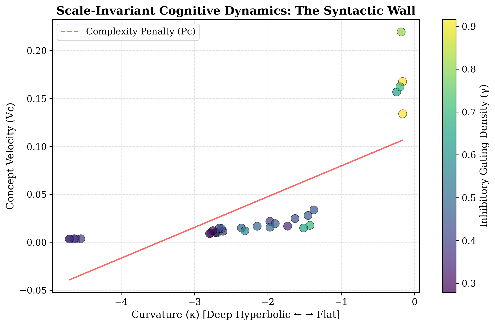

# Scale-Invariant Cognitive Dynamics: The Hyperbolic Inference Engine

[](https://opensource.org/licenses/MIT)
[](https://www.python.org/downloads/)
[]()

This repository contains the official implementation and experimental code for the paper: **"Scale-Invariant Cognitive Dynamics: The Human-AI System as a Hyperbolic Inference Engine"** by Matthew A. Pender (2026).

## Overview

This research proposes that intelligence is fundamentally the **regulation of functional curvature**. We model the Large Language Model (LLM) as a latent semantic manifold $\mathcal{M}$ and the human operator as an inhibitory gating agent ($\gamma$).

By applying inhibitory constraints (prompts), the human operator "warps" the AI's functional manifold to match the hierarchical depth of the inquiry. This repository provides the tools to measure this warping using **Discrete Ricci Curvature** and identifies a catastrophic efficiency collapse known as the **"Syntactic Wall."**

### Key Findings
*   **The Syntactic Wall:** A geometric vacuum identified between Concept Velocity $V_c = 0.05$ and $V_c = 0.13$ where deep logical inference and high-speed traversal become mutually exclusive.
*   **Geometric Phase Transition:** As gating density increases ($\gamma > 0.45$), the system undergoes a sudden "Curvature Deepening," shifting from associative states to extreme logical regimes.
*   **The Complexity Penalty ($P_c$):** A near-perfect correlation ($r = 0.9210$) showing that logical precision is fundamentally "tax-bound" by a reduction in semantic throughput.

---

## Installation

This implementation uses `PyTorch` for manifold extraction and `POT` (Python Optimal Transport) for calculating the Wasserstein distance used in the Ricci Curvature formulation.

```bash
pip install torch transformers numpy pandas matplotlib scipy pot
```

---

## Usage

To replicate the N-Expansion Test and generate the bimodal cognitive state-space mapping (the "Syntactic Wall" plot):

```bash
python run_dyad_test.py
```

### Metrics Calculated

The engine quantifies the topological state of the Inference Dyad using four primary mathematical pillars:

1. **Center of Mass ($z_{cm}$):** 
   Defines the semantic state within the Riemannian manifold $\mathcal{M}$. It is calculated as the L2-normalized, probability-weighted average of the top-$k$ predicted token embedding vectors.

$$
z_{cm} = \frac{\sum_{i=1}^{k} P(w_{i} \mid \text{context}) \cdot \mathbf{e}_{i}}{\Vert \sum_{i=1}^{k} P(w_{i} \mid \text{context}) \cdot \mathbf{e}_{i} \Vert}
$$

2. **Discrete Ricci Curvature ($\kappa$):** 
   Utilizes the Ollivier-Ricci formulation to identify the local geometry of the information graph. A value of $\kappa < 0$ denotes a hyperbolic regime where conceptual potential expands relative to displacement.
   $$\kappa(x, y) = 1 - \frac{W_1(\mu_x, \mu_y)}{d_{cos}(z_x, z_y)}$$

3. **Effective Gating ($\gamma_{eff}$):** 
   Represents the human-applied inhibitory constraint. It measures the reduction in Shannon Entropy ($H$) of the predicted distribution relative to an unconstrained reference state.
   $$\gamma_{eff} = 1 - \frac{H(P_{prompt})}{H(P_{ref})}$$

4. **Concept Velocity ($V_c$):** 
   A proxy for metabolic efficiency. It measures the semantic displacement achieved per token generated. The "Syntactic Wall" is characterized by a collapse in this velocity as curvature deepens.
   $$V_c = \frac{d_{cos}(z_{start}, z_{end})}{N_{tokens}}$$

---

## Visualization: Mapping the Syntactic Wall

The experiment generates a topological map of the LLM's cognitive state-space. By plotting **Discrete Ricci Curvature ($\kappa$)** against **Concept Velocity ($V_c$)**, we observe a clear bimodal distribution separated by a "Geometric Vacuum."



### Understanding the Plot:
*   **The Associative Regime (Top Right, Yellow/Green):**
    Characterized by flat curvature ($\kappa > -1.0$) and high velocity ($V_c > 0.15$). In this state, the model moves efficiently through semantic space with minimal inhibitory gating.
    
*   **The "Cognitive Cliff" (The Gap):**
    A sharp phase transition where no data points exist between $V_c = 0.05$ and $V_c = 0.13$. This identifies the **Syntactic Wall**, where the manifold's structure can no longer support high-velocity traversal.

*   **The Extreme Logic Regime (Bottom Left, Blue/Purple):**
    High inhibitory gating ($\gamma > 0.45$) forces the system into deep hyperbolic curvature ($\kappa < -3.0$). Here, the **Complexity Penalty ($P_c$)**—represented by the red dashed trendline—shows the significant "tax" paid in semantic throughput to achieve logical precision.

> **Note:** To generate this plot with your own data or different models, run `python run_dyad_test.py`. The script will automatically save high-resolution PNG and PDF versions of your results.


